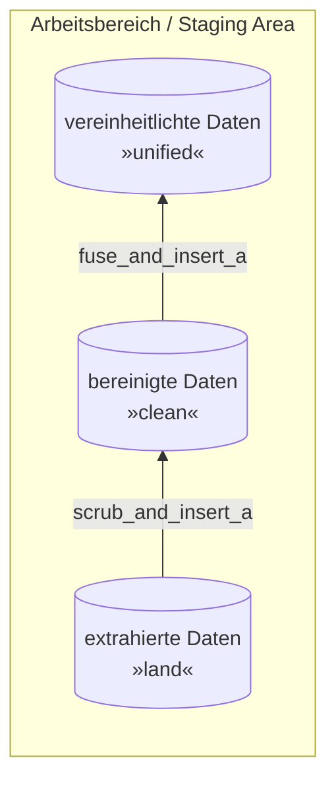

# Leistungsnachweis 2 a - Staging Area - Ski Ressort

> Quelle des Datensatzes: [www.mavenanalytics.io](https://www.mavenanalytics.io/data-playground)

## Arbeitsbereich / Statging Area

Ziel der Aufgabe ist die Fehlerbereinigung der Daten.



Wie in Übung 4 werden zwei `PROCEDURE`s geschrieben:

- `scrub_and_insert_a`: Kopieren der Daten von `land` nach `clean`, dabei werden Problemfälle bereinigt
- `fuse_and_insert_a`: Kopieren der Daten von `clean` nach `unified`, dabei werden Duplikate entfernt

> Hinweis: Die Daten aus `land` werden **nie** verändert bzw. bleiben stets unverändert.
> Um sicherzugehen, lade die Daten erneut aus den *CSV-Dateien* in die `land`-Tabelle.

## scrub_and_insert_a

Schreibe eine **generische** `PROCEDURE` `scrub_and_insert_a`.
Diese soll folgendes tun:

- *Unzulässige Werte:* (6x) Diese sollen komplett gelöscht werden (also nicht in `clean`) eingefügt werden.
- *Fehlende Werte:* (7x) Diese sollen ebenfalls komplett gelöscht werden.
- *Schreibfehler:* (5x) Diese sollen bereinigt werden, dabei sollen exakt diese Schreibfehler für alle Datensätze berichtigt werden.
- *Kryptische Werte:* (2x) Die Kryptischen Werte sollen berichtigt / ausgeschrieben werden.

### Lösung 1

Die Lösung (= `PROCEDURE`) hier eintragen:

```sql
DELIMITER //
CREATE PROCEDURE scrub_and_insert_a ()
BEGIN
CREATE TABLE clean.snow AS (
	SELECT *
	FROM land.snow
	WHERE STR_TO_DATE(land.snow.month,"%Y-%m-%d") IS NOT NULL AND month < CURDATE()
		AND ABS(latitude) < 90 OR ABS(longitude) < 180
		AND snow > 0 OR snow < 100
);
CREATE TABLE clean.resorts AS (
	SELECT *
	FROM land.resorts
	WHERE Resort IS NOT NULL AND Continent IS NOT NULL AND Country IS NOT NULL AND Price IS NOT NULL AND ID IS NOT NULL
		AND Continent IN ('Europe','North America', 'South America', 'Oceania', 'Asia')
		AND Country NOT IN ('United Kingdmo', 'Italie', 'Fränze', 'I.')
);
END //
DELIMITER ;


DELIMITER //
CREATE PROCEDURE scrub_and_insert_a ()
BEGIN
SET SESSION SQL_MODE='ALLOW_INVALID_DATES';
CREATE TABLE clean.snow AS (
	SELECT *
	FROM land.snow
	WHERE land.snow.month REGEXP '^([1-9]|0[1-9]|1[012])/([1-9]|0[1-9]|[12][0-9]|3[01])/(19|20)[0-9][0-9]' AND month < CURDATE()
		AND ABS(latitude) < 90 AND ABS(longitude) < 180
		AND snow > 0 AND snow < 100
);
CREATE TABLE clean.resorts AS (
	SELECT *
	FROM land.resorts
	WHERE Resort IS NOT NULL AND Continent IS NOT NULL AND Country IS NOT NULL AND Price IS NOT NULL AND ID IS NOT NULL
		AND Continent IN ('Europe','North America', 'South America', 'Oceania', 'Asia')
		AND Country NOT IN ('United Kingdmo', 'Italie', 'Fränze', 'I.')
);
END //
DELIMITER ;
```

### Hilfe 1

*Um die Suche einfacher zu gestalten, ist hier der Code enthalten, welcher die Fehler generiert:*

```python
# unzulässiger Wert
def simulate_invalid_values() -> pd.DataFrame:
    df_snow.at[get_random_index(df_snow), "Month"] = "2040-12-01"
    df_snow.at[get_random_index(df_snow), "Month"] = "2022-14-01"
    df_snow.at[get_random_index(df_snow), "Latitude"] = 9999
    df_snow.at[get_random_index(df_snow), "Longitude"] = 9999
    df_snow.at[get_random_index(df_snow), "Snow"] = -70
    df_snow.at[get_random_index(df_snow), "Snow"] = 150
    return df_snow
df_snow = simulate_invalid_values()

# Fehlende Werte
def simulate_missing() -> pd.DataFrame:
    df_resorts.at[get_random_index(df_resorts), "ID"] = None
    df_resorts.at[get_random_index(df_resorts), "Resort"] = None
    df_resorts.at[get_random_index(df_resorts), "Resort"] = None
    df_resorts.at[get_random_index(df_resorts), "Continent"] = None
    df_resorts.at[get_random_index(df_resorts), "Continent"] = ""
    df_resorts.at[get_random_index(df_resorts), "Price"] = None
    df_resorts.at[get_random_index(df_resorts), "Season"] = None
    return df_resorts
df_resorts = simulate_missing()

# Schreibfehler
def simulate_misspelling() -> pd.DataFrame:
    df_resorts.at[random.choice(df_resorts[df_resorts["Continent"] == "Europe"].index), "Continent"] = "Europes"
    df_resorts.at[random.choice(df_resorts[df_resorts["Country"] == "France"].index), "Country"] = "Fränze"
    df_resorts.at[random.choice(df_resorts[df_resorts["Country"] == "United Kingdom"].index), "Country"] = "United Kingdmo"
    df_resorts.at[random.choice(df_resorts[df_resorts["Country"] == "Italy"].index), "Country"] = "Italie"
    df_resorts.at[random.choice(df_resorts[df_resorts["Continent"] == "North America"].index), "Continent"] = "North Amerisa"
    return df_resorts
df_resorts = simulate_misspelling()

# Kryptische Werte
def simulate_cryptic() -> pd.DataFrame:
    df_resorts.at[random.choice(df_resorts[df_resorts["Country"] == "Italy"].index), "Country"] = "I."
    df_resorts.at[random.choice(df_resorts[df_resorts["Continent"] == "Europe"].index), "Continent"] = "C."
    return df_resorts
df_resorts = simulate_cryptic()
```

## fuse_and_insert_a

Schreibe eine **generische** ´PROCEDURE´ `fuse_and_insert_a`, welche die Duplikate entfernt und die Daten von `clean` nach `unified` schreibt.

### Lösung 2

Die Lösung (= `PROCEDURE`) hier eintragen:

```sql
DELIMITER //
CREATE PROCEDURE fuse_and_insert_a ()
BEGIN
CREATE TABLE unified.snow AS (
	SELECT DISTINCT *
	FROM clean.snow
);
CREATE TABLE unified.resorts AS (
	SELECT DISTINCT *
	FROM clean.resorts
);

END //
DELIMITER ;
```

### Hilfe 2

*Um die Suche einfacher zu gestalten, ist hier der Code, welcher die Duplikate erzeugt hat:*

```python
# Duplikate
def simulate_duplicates() -> pd.DataFrame:
    df_duplicates = df_resorts.iloc[get_random_number_of_indexes(df_resorts, 5)] # <- 5 Duplikate wurden erzeugt
    return pd.concat([df_resorts, df_duplicates], ignore_index=True)
df_resorts = simulate_duplicates()
```
