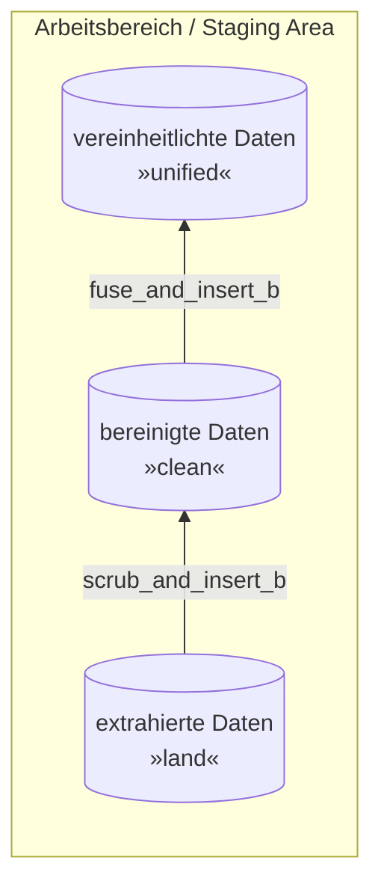

# Leistungsnachweis 2 b - Staging Area - Pizza Place Sales

> Quelle des Datensatzes: [www.mavenanalytics.io](https://www.mavenanalytics.io/data-playground)

## Arbeitsbereich / Statging Area

Ziel der Aufgabe ist die Fehlerbereinigung der Daten.



Wie in Übung 4 werden zwei `PROCEDURE`s geschrieben:

- `scrub_and_insert_b`: Kopieren der Daten von `land` nach `clean`, dabei werden Problemfälle bereinigt
- `fuse_and_insert_b`: Kopieren der Daten von `clean` nach `unified`, dabei werden Duplikate entfernt

> Hinweis: Die Daten aus `land` werden **nie** verändert bzw. bleiben stets unverändert.
> Um sicherzugehen, lade die Daten erneut aus den *CSV-Dateien* in die `land`-Tabelle.

## scrub_and_insert_b_b_b

Schreibe eine **generische** `PROCEDURE` `scrub_and_insert_b`.
Diese soll folgendes tun:

- *Unzulässige Werte:* (5x) Diese sollen komplett gelöscht werden (also nicht in `clean`) eingefügt werden.
- *Fehlende Werte:* (7x) Diese sollen ebenfalls komplett gelöscht werden.
- *Schreibfehler:* (6x) Diese sollen bereinigt werden, dabei sollen exakt diese Schreibfehler für alle Datensätze berichtigt werden.
- *Falsche Referenz:* (2x) Diese soll korrekt gesetzt werden. Hierfür eine sinnvolle Logik vorschlagen.
- *Kryptische Werte:* (1x, "S." wurde mehrmals vergeben) Die Kryptischen Werte sollen berichtigt / ausgeschrieben werden.

### Lösung 1

Die Lösung (= `PROCEDURE`) hier eintragen:

```sql
/* Lösung */
```

### Hilfe 1

*Um die Suche einfacher zu gestalten, ist hier der Code enthalten, welcher die Fehler generiert:*

```python
# unzulässiger Wert DONE
def simulate_invalid_values() -> pd.DataFrame:
    df_pizzas.at[get_random_index(df_pizzas), "price"] = -99.0
    df_pizzas.at[get_random_index(df_pizzas), "price"] = -10
    df_pizzas.at[get_random_index(df_pizzas), "price"] = None
    df_pizzas.at[get_random_index(df_pizzas), "size"] = "XXXXXXXXXXXXXXXXXL"
    df_pizzas.at[get_random_index(df_pizzas), "size"] = "MMMMMMMMMMMMM"
    return df_pizzas
df_pizzas = simulate_invalid_values()

# Fehlende Werte DONE
def simulate_missing() -> pd.DataFrame:
    df_pizza_types.at[get_random_index(df_pizza_types), "category"] = None
    df_pizza_types.at[get_random_index(df_pizza_types), "category"] = ""
    df_pizza_types.at[get_random_index(df_pizza_types), "category"] = None
    df_pizza_types.at[get_random_index(df_pizza_types), "name"] = ""
    df_pizza_types.at[get_random_index(df_pizza_types), "name"] = None
    df_pizza_types.at[get_random_index(df_pizza_types), "name"] = ""
    df_pizza_types.at[get_random_index(df_pizza_types), "name"] = None
    return df_pizza_types
df_pizza_types = simulate_missing()

# Schreibfehler DONE
def simulate_misspelling():
    df_pizza_types.at[random.choice(df_pizza_types[df_pizza_types["category"] == "Chicken"].index), "category"] = "ChiKKKKen"
    df_pizza_types.at[random.choice(df_pizza_types[df_pizza_types["category"] == "Chicken"].index), "category"] = "ChiKKKKen"
    df_pizza_types.at[random.choice(df_pizza_types[df_pizza_types["category"] == "Chicken"].index), "category"] = "ChiKKKKen"
    df_pizza_types.at[random.choice(df_pizza_types[df_pizza_types["category"] == "Classic"].index), "category"] = "ClassicKK"
    df_pizza_types.at[random.choice(df_pizza_types[df_pizza_types["category"] == "Classic"].index), "category"] = "ClassicKK"
    df_pizza_types.at[random.choice(df_pizza_types[df_pizza_types["name"] == "The Mexicana Pizza"].index), "name"] = "The Mexicana PiKKKa"
    return df_pizza_types
df_pizza_types = simulate_misspelling()

# Falsche Referenz
def simulate_wrong_reference() -> None:
    df_pizzas.loc[43, "pizza_type_id"] = "bbq_ckn"
    df_pizzas.loc[60, "pizza_type_id"] = "veggie_veg"
simulate_wrong_reference()

# Kryptische Werte
def simulate_cryptic() -> pd.DataFrame:
    df_pizza_types["ingredients"] = df_pizza_types["ingredients"].apply(lambda x: x.replace("Salami", "S."))
    return df_pizza_types
df_pizza_types = simulate_cryptic()
```

## fuse_and_insert_b

Schreibe eine **generische** ´PROCEDURE´ `fuse_and_insert_b`, welche die Duplikate entfernt und die Daten von `clean` nach `unified` schreibt.

### Lösung 2

Die Lösung (= `PROCEDURE`) hier eintragen:

```sql
/* Lösung */
```

### Hilfe 2

*Um die Suche einfacher zu gestalten, ist hier der Code, welcher die Duplikate erzeugt hat:*

```python
# Duplikate
def simulate_duplicates() -> pd.DataFrame:
    df_duplicates = df_order_details.iloc[get_random_number_of_indexes(df_order_details, 5)] # <- 5 Duplikate wurden erzeugt
    return pd.concat([df_order_details, df_duplicates], ignore_index=True)
df_order_details = simulate_duplicates()
```
