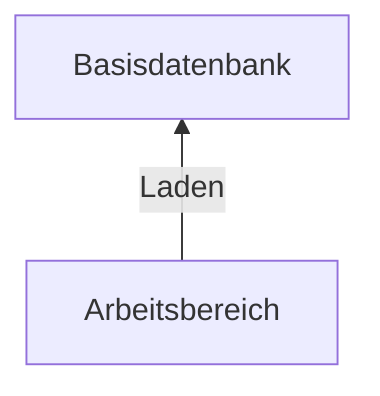
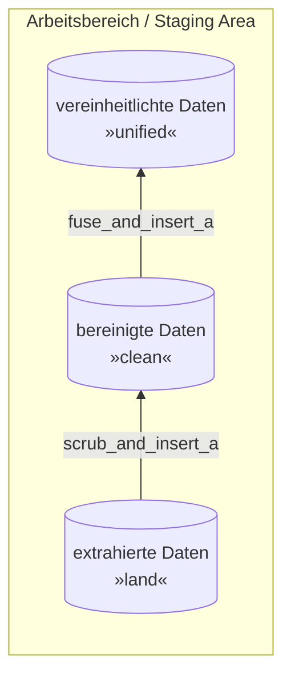
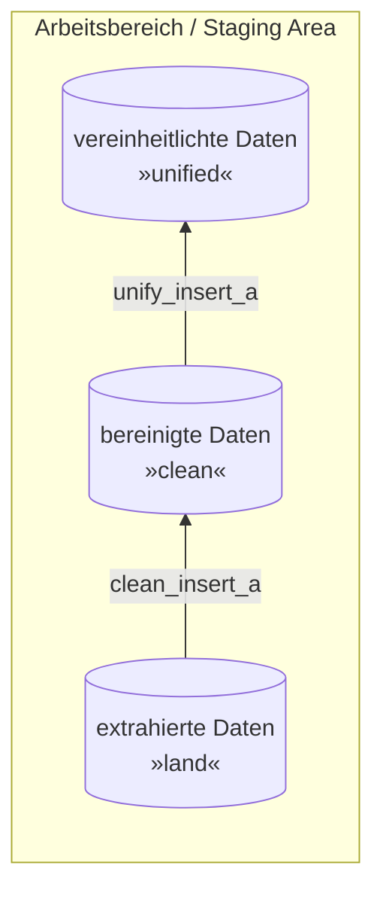

# Leistungsnachweis 3 a - Core Data Warehouse - Ski Ressort

## Intro

> Hinweis: Das Diagramm wird nur angezeigt, wenn folgende Extension installiert ist: *Markdown Preview Mermaid Support*



Wie in Kapitel 2 Seite 102 beschrieben, ist die **Basisdatenbank** eine zentralisierte Datenbasis für analtische Anwendungen mit folgenden Charakteristika:

- **Integrierte,** historisierte Aufbereitung der analyserelevanten Daten der angebundenen Datenquellen
- **Bereinigte,** konsolidierte Datenwerte
- **Analyseneutral**

Bisher haben wir nach folgenden Schema aufbereitet:



Allerdings wie in Kapitel 2 Seite 92 beschrieben sieht der vereinheitlichte Datenbestand ebenfalls vor, dass es in der **Zielstruktur** vorliegt. Normalerweise wird bei einer initialen Integration von neuen Datenquellen definiert, wie die Zielstruktur in der **Basisdatenbank** aussieht. Anschließend werden die Daten bei mehrmaligen updaten in die **Zielstruktur** (Teil des Arbeitsbereiches) gebracht und anschließend in die Basisdatenbank hinzugefügt / angefügt.
Bisher haben die Methoden bzw. stored Procedures folgendes gemacht:

- `scrub_and_insert_a`: Fehlerbereinigung aller Fehler, ohne Duplikatentfernung und Schreiben Richtung `clean`
- `fuse_and_insert_a`: Entfernung der Duplikate und Schreiben in `unified`

Wie im obersten Graph zu sehen, ist, gibt es zwischen **Arbeitsbereich** und **Basisdatenbank** keine *Transformation*, lediglich *Laden*.
Deshalb wird die bisherige Vorgehensweise leicht abgewandelt:



Dabei ist das Schema von `land` und `clean` gleichermaßen aufgebaut.

- `land` enthält alle Daten in unveränderter Form, noch mit allen Fehlern und Duplikaten enthalten.
- `clean` enthält die Daten in fehlerfreier Form, mit korrigierten Daten, ohne Duplikate.
- `unified` enthält alle Daten in fehlerfreier Form, nach **Zielstruktur**, das heißt (wahrscheinlich) anderen Schema

> Hinweis: Das Schema wird nicht zwangsläufig geändert, allerdings sind üblicherweise Schemata nach und für die Quelldatenbank entwickelt und dementsprechend erfüllen sie nicht die Anforderungen einer **Zielstruktur** der **Basisdatenbank**.

Die Beiden Methoden erfüllen nun folgende Zwecke:

- `clean_insert_a`:
  - liest die Daten aus `land`
  - behebt alle Fehler (wurde bisher mit `scrub_and_insert_a` gemacht)
  - entfernt alle Duplikate (wurde bisher mit `fuse_and_insert_a` gemacht)
  - schreibt die Daten in `clean`
- `unify_insert_a`:
  - liest die Daten aus `clean`
  - passt sie der **Zielstruktur** an
  - schreibt die Daten in `unified`

## Clean insert

Schreibe eine die Funktion (`PROCEDURE`) `clean_insert_a`, welche die oben beschriebenen Anforderungen erfüllt.
Dafür kannst du die bisher entwickelten Funktionen `scrub_and_insert_a` und `fuse_and_insert_a` wiederverwenden bzw. Teile davon wiederverwenden.

```sql
DELIMITER //
CREATE PROCEDURE clean_insert_a ()
BEGIN
CREATE TABLE clean.snow AS (
    SELECT DISTINCT *
    FROM land.snow
    WHERE land.snow.month REGEXP '^([1-9]|0[1-9]|1[012])/([1-9]|0[1-9]|[12][0-9]|3[01])/(19|20)[0-9][0-9]' AND month < CURDATE()
        AND ABS(latitude) < 90 OR ABS(longitude) < 180
        AND snow > 0 OR snow < 100
);
CREATE TABLE clean.resorts AS (
    SELECT DISTINCT *
    FROM land.resorts
    WHERE Resort IS NOT NULL AND Continent IS NOT NULL AND Country IS NOT NULL AND Price IS NOT NULL AND ID IS NOT NULL
        AND Continent IN ('Europe','North America', 'South America', 'Oceania', 'Asia')
);

UPDATE clean.snow
SET Country = "United Kingdom"
WHERE Country LIKE "United Kingdmo";

UPDATE clean.snow
SET Country = "Italy"
WHERE Country LIKE "Italie";

UPDATE clean.snow
SET Country = "France"
WHERE Country LIKE "Fränze";

UPDATE clean.snow
SET Country = "Italy"
WHERE Country LIKE "I.";


END //
DELIMITER ;
```

## Zielstruktur definieren

Wie oben beschrieben liegen die Daten in der `unified` Datenbank bereits in der **Zielstruktur** vor. Dabei handelt es sich um die gleiche Struktur (= Datenbankschema) wie in der **Basisdatenbank**.

Im folgenden gilt es diese Struktur zu definieren.
Hierfür werden folgende Anforderungen gesetzt:

- *korrekte / optimale Datentypen:* bisher wurden oftmals falsche Datentypen bzw. nicht optimale Datentypen gewählt.
- *Normalisierung:* Für die **Basisdatenbank** empfiehlt sich die Abbildung in der dritten Normalform (3NF).
- *fachlich getrennte Daten:* Aktuell sind mehrere fachliche Domänen vermischt. Beispielsweise Informationen über die Bevölkerung und Informationen über die Wirtschaft. Diese sollen sinnvoll aufgeteilt werden.

Entwickle eine **Zielstruktur** um die genannten Anforderungen zu erfüllen.

```sql
-- hier Zielstruktur eintragen
```

## Unify insert

Schreibe eine Funktion (`PROCEDURE`) `unify_insert_a`, welche die oben beschriebenen Anforderungen erfüllt.
Das heißt, die Daten von `clean` in die Zielstruktur von `unified` schreibt.

```sql
DELIMITER //
CREATE PROCEDURE unify_insert_a ()
BEGIN
	
CREATE TABLE unified.countries(
	country_name VARCHAR(60),
	continent VARCHAR(20),
	CONSTRAINT pk_countries PRIMARY KEY(country_name)
);

CREATE TABLE unified.resorts (
 	id INT AUTO_INCREMENT,
 	resort VARCHAR(256),
 	latitude FLOAT,
 	longitude FLOAT,
 	country VARCHAR(60),
 	price INT,
 	season VARCHAR(256),
 	highest_point INT,
 	lowest_point INT,
 	beginner_slopes INT,
 	intermediate_slopes INT,
 	difficult_slopes INT,
 	total_slopes INT,
 	longest_run INT,
 	snow_cannons INT,
 	surface_lifts INT,
 	chair_lifts INT,
 	gondola_lifts INT,
 	total_lifts INT,
 	lift_capacity INT,
 	child_friendly BOOLEAN,
 	snowparks BOOLEAN,
 	nightskiing BOOLEAN,
 	summer_skiing BOOLEAN,
 	CONSTRAINT fk_country FOREIGN KEY(country) REFERENCES unified.countries(country_name),
 	CONSTRAINT pk_resorts PRIMARY KEY(id)
);

CREATE TABLE unified.snow (
	snow_month DATE,
	latitude FLOAT,
	longitude FLOAT,
	snow FLOAT,
	CONSTRAINT pk_snow PRIMARY KEY(snow_month, latitude, longitude)
);

INSERT INTO unified.snow 
	SELECT STR_TO_DATE(clean.snow.month, '%Y-%m-%d'), CAST(latitude AS FLOAT), CAST(longitude AS FLOAT), CAST(snow AS FLOAT)
	FROM clean.snow;

INSERT INTO unified.resorts (resort, latitude, longitude, country, price, season, highest_point, lowest_point, beginner_slopes, intermediate_slopes, difficult_slopes, total_slopes, longest_run, snow_cannons, surface_lifts, chair_lifts, gondola_lifts, total_lifts, lift_capacity, child_friendly, snowparks, nightskiing, summer_skiing)
	SELECT CAST(resort AS VARCHAR(256)), CAST(latitude AS FLOAT), CAST(longitude AS FLOAT),
	CAST(country AS VARCHAR(60)), CAST(price AS INT), CAST(season AS VARCHAR(256)), 
	CAST('highest point' AS INT), CAST('lowest point' AS INT), CAST('beginner slopes' AS INT), 
	CAST('intermediate slopes' AS INT), CAST('difficult slopes' AS INT), CAST('total slopes' AS INT), 
	CAST('longest run' AS INT), CAST('snow cannons' AS INT), CAST('surface lifts' AS INT), 
	CAST('chair lifts' AS INT), CAST('gondola_lifts' AS INT), CAST('total lifts' AS INT), 
	CAST('lift capacity' AS INT), STRCMP('child friendly', 'yes'), STRCMP(snowparks, 'yes'), 
	STRCMP(nightskiing, 'yes'), STRCMP('summer skiing', 'yes')
	FROM clean.resorts;

INSERT INTO unified.countries
    SELECT CAST(country_name AS VARCHAR(60)), CAST(continent AS VARCHAR(20))
   	FROM clean.resorts;


END //
DELIMITER;
```
