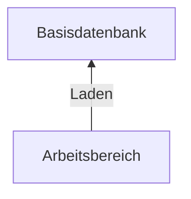
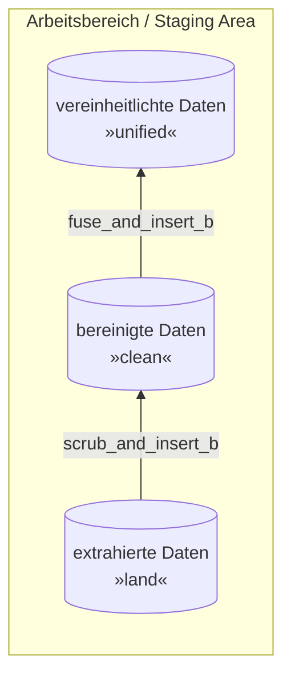
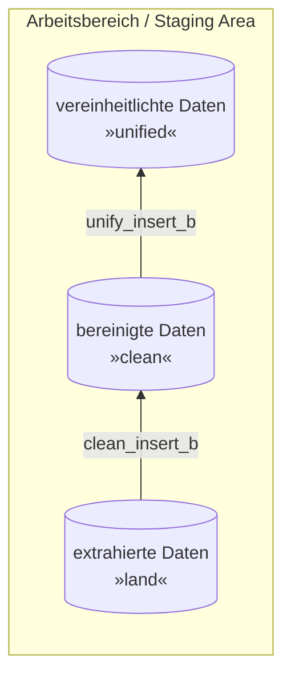

# Leistungsnachweis 3 b - Core Data Warehouse - Pizza Place Sales

## Intro

> Hinweis: Das Diagramm wird nur angezeigt, wenn folgende Extension installiert ist: *Markdown Preview Mermaid Support*



Wie in Kapitel 2 Seite 102 beschrieben, ist die **Basisdatenbank** eine zentralisierte Datenbasis für analtische Anwendungen mit folgenden Charakteristika:

- **Integrierte,** historisierte Aufbereitung der analyserelevanten Daten der angebundenen Datenquellen
- **Bereinigte,** konsolidierte Datenwerte
- **Analyseneutral**

Bisher haben wir nach folgenden Schema aufbereitet:



Allerdings wie in Kapitel 2 Seite 92 beschrieben sieht der vereinheitlichte Datenbestand ebenfalls vor, dass es in der **Zielstruktur** vorliegt. Normalerweise wird bei einer initialen Integration von neuen Datenquellen definiert, wie die Zielstruktur in der **Basisdatenbank** aussieht. Anschließend werden die Daten bei mehrmaligen updaten in die **Zielstruktur** (Teil des Arbeitsbereiches) gebracht und anschließend in die Basisdatenbank hinzugefügt / angefügt.
Bisher haben die Methoden bzw. stored Procedures folgendes gemacht:

- `scrub_and_insert_b`: Fehlerbereinigung aller Fehler, ohne Duplikatentfernung und Schreiben Richtung `clean`
- `fuse_and_insert_b`: Entfernung der Duplikate und Schreiben in `unified`

Wie im obersten Graph zu sehen, ist, gibt es zwischen **Arbeitsbereich** und **Basisdatenbank** keine *Transformation*, lediglich *Laden*.
Deshalb wird die bisherige Vorgehensweise leicht abgewandelt:



Dabei ist das Schema von `land` und `clean` gleichermaßen aufgebaut.

- `land` enthält alle Daten in unveränderter Form, noch mit allen Fehlern und Duplikaten enthalten.
- `clean` enthält die Daten in fehlerfreier Form, mit korrigierten Daten, ohne Duplikate.
- `unified` enthält alle Daten in fehlerfreier Form, nach **Zielstruktur**, das heißt (wahrscheinlich) anderen Schema

> Hinweis: Das Schema wird nicht zwangsläufig geändert, allerdings sind üblicherweise Schemata nach und für die Quelldatenbank entwickelt und dementsprechend erfüllen sie nicht die Anforderungen einer **Zielstruktur** der **Basisdatenbank**.

Die Beiden Methoden erfüllen nun folgende Zwecke:

- `clean_insert_b`:
  - liest die Daten aus `land`
  - behebt alle Fehler (wurde bisher mit `scrub_and_insert_b` gemacht)
  - entfernt alle Duplikate (wurde bisher mit `fuse_and_insert_b` gemacht)
  - schreibt die Daten in `clean`
- `unify_insert_b`:
  - liest die Daten aus `clean`
  - passt sie der **Zielstruktur** an
  - schreibt die Daten in `unified`

## Clean insert

Schreibe eine die Funktion (`PROCEDURE`) `clean_insert_b`, welche die oben beschriebenen Anforderungen erfüllt.
Dafür kannst du die bisher entwickelten Funktionen `scrub_and_insert_b` und `fuse_and_insert_b` wiederverwenden bzw. Teile davon wiederverwenden.

```sql
-- PROCEDURE clean_insert_b
DELIMITER //
CREATE PROCEDURE land.clean_insert_b ()
BEGIN

CREATE TABLE clean.pizzas AS (
    SELECT DISTINCT *
    FROM land.pizzas
    WHERE (size = 'S' OR size = 'M' OR size = 'L' OR size = 'XL' OR size = 'XXL')
        AND price IS NOT NULL AND price > 0
);

CREATE TABLE clean.pizza_types AS (
        SELECT DISTINCT REPLACE(REPLACE(category, 'KKKK', 'ck'), 'KK','') AS category , REPLACE(name, 'KKK', 'zz') AS name, REPLACE(ingredients, 'S.', 'Salami') as ingredients , pizza_type_id 
    FROM land.pizza_types
    WHERE category != "" AND category IS NOT NULL
        AND name != "" AND name IS NOT NULL
);
CREATE TABLE clean.orders AS (
    SELECT DISTINCT *
    FROM land.orders
);

CREATE TABLE clean.order_details AS (
    SELECT DISTINCT *
    FROM land.order_details
);

UPDATE clean.pizzas 
SET pizzas.pizza_type_id = REGEXP_REPLACE(pizza_id , '_xxl|_xl|_l|_m|_s', '')
WHERE pizzas.pizza_id NOT LIKE concat('%',pizzas.pizza_type_id,'%');

END //
DELIMITER ;
```

## Zielstruktur definieren

Wie oben beschrieben liegen die Daten in der `unified` Datenbank bereits in der **Zielstruktur** vor. Dabei handelt es sich um die gleiche Struktur (= Datenbankschema) wie in der **Basisdatenbank**.

Im folgenden gilt es diese Struktur zu definieren.
Hierfür werden folgende Anforderungen gesetzt:

- *korrekte / optimale Datentypen:* bisher wurden oftmals falsche Datentypen bzw. nicht optimale Datentypen gewählt.
- *Normalisierung:* Für die **Basisdatenbank** empfiehlt sich die Abbildung in der dritten Normalform (3NF).
- *fachlich getrennte Daten:* Aktuell sind mehrere fachliche Domänen vermischt. Beispielsweise Informationen über die Bevölkerung und Informationen über die Wirtschaft. Diese sollen sinnvoll aufgeteilt werden.

Entwickle eine **Zielstruktur** um die genannten Anforderungen zu erfüllen.

```sql
-- hier Zielstruktur eintragen
```

## Unify insert

Schreibe eine Funktion (`PROCEDURE`) `unify_insert_b`, welche die oben beschriebenen Anforderungen erfüllt.
Das heißt, die Daten von `clean` in die Zielstruktur von `unified` schreibt.

```sql
-- PROCEDURE unify_insert_b
DELIMITER //
CREATE OR REPLACE PROCEDURE clean.unify_insert_b ()
BEGIN

CREATE TABLE unified.pizza_types (
    category VARCHAR(69),
    pizza_name VARCHAR(69),
    ingredients VARCHAR(420),
    pizza_type VARCHAR(69),
    CONSTRAINT pk_pizza_types PRIMARY KEY(pizza_type)
);

INSERT INTO unified.pizza_types 
    SELECT category, name, ingredients, pizza_type_id
    FROM clean.pizza_types;

CREATE TABLE unified.pizzas (
    pizza_type VARCHAR(69),
    pizza_size VARCHAR(3),
    price FLOAT,
    CONSTRAINT pk_pizzas PRIMARY KEY(pizza_type,pizza_size),
    CONSTRAINT fk_pizza_types FOREIGN KEY(pizza_type) REFERENCES unified.pizza_types(pizza_type)
);

INSERT INTO unified.pizzas
    SELECT pizza_type_id, CAST(clean.pizzas.size AS VARCHAR(3)), price
    FROM clean.pizzas;

CREATE TABLE unified.orders (
    id INT,
    order_time DATETIME,
    CONSTRAINT pk_orders PRIMARY KEY(id)
);

INSERT INTO unified.orders
    SELECT order_id, TIMESTAMP(clean.orders.date, clean.orders.time)
    FROM clean.orders;

CREATE TABLE unified.order_details (
    id INT,
    order_id INT,
    pizza_name VARCHAR(69),
    pizza_size VARCHAR(3),
    quantity INT,
    CONSTRAINT pk_order_details PRIMARY KEY(id),
    CONSTRAINT fk_order FOREIGN KEY(order_id) REFERENCES unified.orders(id),
    CONSTRAINT fk_pizza FOREIGN KEY(pizza_name, pizza_size) REFERENCES unified.pizzas(pizza_type, pizza_size)
);

INSERT INTO unified.order_details 
    SELECT order_details_id, order_id, REGEXP_REPLACE(pizza_id , '_xxl|_xl|_l|_m|_s', ''), UPPER((REPLACE(REGEXP_SUBSTR(pizza_id, '_xxl|_xl|_l|_m|s'), '', ''))) , quantity
    FROM clean.order_details;

END //
DELIMITER ;
```
