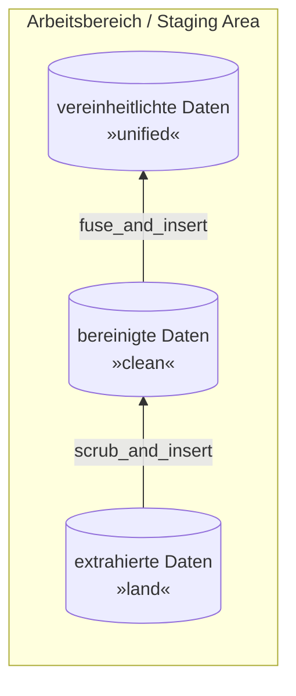

# Übung 4 - Arbeitsbereich DWH automatisiert

## Intro

> Hinweis: Das Diagramm wird nur angezeigt, wenn folgende Extension installiert ist: *Markdown Preview Mermaid Support*



In Übung 3 wurden manuell die Fehler gesucht.
Hierfür hattest du die freie Wahl, wie diese Fehler behoben werden.
Möglichkeiten waren hier über die SQL-GUI oder SQL Queries.
Bei SQL Queries konnten ebenfalls sehr exakte Queries geschrieben werden wie "Ändere Wert X genau von dieser Zeile".
Außerdem konnte es über eher generische Queries gelöst werden.
Im folgenden werden die Daten über generisches Queries bearbeitet.
Das heißt, **Data Scrubbing** und **Data Fusion** wird mittels generischer Queries in `PROCEDURE`s durchgeführt.

## Queries zum Auffinden der Problemfälle

> Verwende noch **keine** `PROCEDURE`, ausschließlich ein `SELECT`.

- **Unzulässiger Wert:** Schreibe eine generische Queries um diese Fehler zu finden. Hier waren folgende Fehler enthalten:
  - `Indonesia`: `population` -> negativ Wert
  - `Sweden`: `area_sq_km` -> negativer Wert
  - `Romania`: `agriculture` -> Wert mehrfach wiederholt
  - `Serbia`: `industry` -> Wert mehrfach wiederholt

    ```sql
    SELECT * FROM countries
    WHERE population < 0
    OR area_sq_km < 0
    OR agriculture LIKE '%,%,%'
    OR industry LIKE '%,%,%'
    ```

- **Fehlende Werte:** Schreibe eine Query um alle Länder mit fehlenden Werten zu finden. Finde alle Länder, welche für die Spalten `population`, `net_migration`, `crops_percent` und `climate` keine Werte enthalten haben und damit leer sind.  
Es handelt sich um 20 Länder
  - "American Samoa"
  - "Andorra"
  - "Armenia"
  - "Cook Islands"
  - "Gibraltar"
  - "Greenland"
  - "Guam"
  - "Guernsey"
  - "Malawi"
  - "Mayotte"
  - "Monaco"
  - "Montserrat"
  - "Nauru"
  - "N. Mariana Islands"
  - "Saint Helena"
  - "St Pierre & Miquelon"
  - "San Marino"
  - "Turks & Caicos Is"
  - "Wallis and Futuna"
  - "Western Sahara"

    ```sql
    SELECT *
    FROM countries c 
    WHERE 
      Population = "" OR Population IS NULL
      OR Net_migration = "" OR Net_migration IS NULL
      OR Net_migration = "" OR Net_migration IS NULL
      OR crops_percent = "" OR crops_percent IS NULL
      OR climate = "" OR climate IS NULL
    ```

- **Schreibfehler:** Schreibe eine Query um alle Schreibfehler zu identifizieren.
  > Hinweis: Schreibfehler sind ausschließlich mit "KK" (Doppel-K) enthalten.
  
  Du solltest folgende Werte finden:
  - "IndiaKK"
  - "IrKKan"
  - "RuKKia"
  - "TogKKo"

    ```sql
    SELECT *
    FROM countries c 
    WHERE 
      Country LIKE '%KK%'
    ```

- **Kryptische Werte:** Schreibe eine Query um alle kryptischen Werte anzuzeigen:
  - `region`: "WE"
  - `region`: "EE"

    ```sql
    
    ```

## Duplikate

- **Duplikate:** Schreibe eine Query um alle Duplikate anzuzeigen.  
    > Hinweis: Nutze hierfür `GROUP BY` in Kombination mit `HAVING`  
    > Hinweis 2: Das Keyword `HAVING` im Kontext mit `GROUP BY` ist wie `WHERE` bei `SELECT`

    ```sql
    ```

## Werte korrekt anzeigen

Im folgenden sollen die obigen Fehler durch `SELECT`-Queries bereinigt werden. Ziel ist eine Query, welche die Werte der Spalten mit korrigierten Werten anzeigt. Dabei sollen die zuvor korrekten Werte natürlich nicht verfälscht werden.

- **Unzulässiger Wert:** Schreibe eine `SELECT`-Statement, welches folgende Spalten anzeigt: `Country`, `Population`, `Area_sq_km`, `Agriculture`, `Industry`. Dabei sollen die Werte der Spalten, **falls nötig,** wie folgt ausgebessert werden.
  - `Indonesia`: `population` -> *\*(-1)*
  - `Sweden`: `area_sq_km` -> *\*(-1)*
  - `Romania`: `agriculture` -> *selektiere die ersten 5 Zeichen des Wertes*
  - `Serbia`: `industry` -> *selektiere die ersten 5 Zeichen des Wertes*

  ```sql
  ```

- **Schreibfehler:** Schreibe ein `SELECT`-Statement, welches ausschließlich Spalte `Country` anzeigt. Dabei soll das "KK" (doppel-K) entfernt werden.

  ```sql
  ```

- **Kryptische Werte:** Schreibe ein `SELECT`-Statement, welches die Spalte `Country` und `Region` anzeigt und die Werte wie folgt ersetzt:
  - `region`: "WE" -> "WESTERN EUROPE"
  - `region`: "EE" -> "EASTERN EUROPE"

  ```sql
  ```

- **Data Scrubbing:** Schreibe eine `SELECT`-Statement, welches alle Spalten enthält und die Werte wie zuvor beschrieben behebt:

  ```sql
  ```

## Stored Procedures

> Für eine Beschreibung von `PROCEDURE`, siehe [mariadb - Stored Procedures Overview](https://mariadb.com/kb/en/stored-procedure-overview/).

### Beispiel

- Nehmen wir die simple Query:

    ```sql
    SELECT * FROM countries ;
    ```

- Als Stored `PROCEDURE`, sieht es wie folgt aus:

    ```sql
    DELIMITER $$ -- Temporäre Änderung des Delimiter von normal ";" auf "$$"
    CREATE OR REPLACE PROCEDURE land.get_all_countries()
    BEGIN
        SELECT region, country FROM countries ORDER BY region, country; -- hier steht die "normale" Query
    END$$ -- hiermit wird das Statement beendet
    DELIMITER ; -- Änderung des Delimiter zurück auf ";"
    ```

    Über **DBeaver** kann eine `PROCEDURE` nur erzeugt werden, wenn der Button **Execute SQL Statement** ausgeführt wird.  
    Hier genügt es **nicht** über *STRG + ENTER* auszuführen.

    > Hinweis: Nachdem eine Query innerhalb der Stored `PROCEDURE` enthalten ist, muss zuvor der `DELIMITER` auf etwas anderes gesetzt werden. Im obigen Beispiel wurde er manuell auf "$$" (Doppel-Dollar) gesetzt. Am Ende ist er wie gewohnt bei ";" (Semicolon)

- Die `Procedure` wird über `CALL <procedure_name>;` aufgerufen:

    ```sql
    CALL land.get_all_countries();
    ```

- Schreibe eine `PROCEDURE` namens `clean`.`scrub_and_insert`, welche die Daten aus `land`.`countries` in die `clean`.`countries` kopiert und dabei alle Fehler bereinigt.
  > Hinweis: **nicht** Teil der `PROCEDURE` ist das Erzeugen der Tabelle.

  ```sql
  ```

- Rufe die `PROCEDURE` `clean`.`scrub_and_insert` auf.
  > Falls die Daten bereits in `clean`.`countries` enthalten sind, lösche sie.

  ```sql
  ```

- Schreibe eine `PROCEDURE`, welche die Daten von `clean`.`countries` in `unified`.`countries` schreibt.
  > Tipp: Falls Daten enthalten sind, lösche die zuvor erstellten Daten.

  ```sql
  ```

- Rufe die `PROCEDURE` `unified`.`fuse_and_insert` auf.
  
  ```sql
  ```
